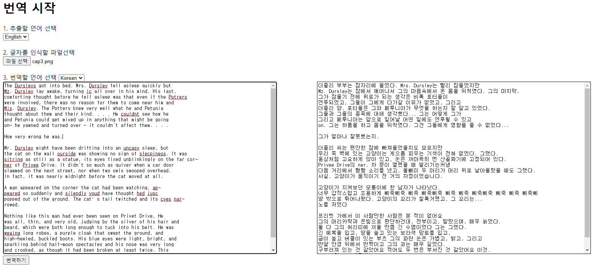

# DataPlay Project : 데이터 갖고 놀기 2탄
Tesseract와 파파고 API 를 이용해서 이미지 번역하기

Image Translator Using Java & Tesseract OCR

# **1. 프로젝트 설명**
- Tesseract OCR 을 활용하여 이미지의 텍스트를 인식 후 네이버 파파고 API 를 사용해서 해당 텍스트를 번역하여 출력하는 프로젝트!
- 인식 언어는 영어, 한국어, 일본어 -> 번역 언어 : 영어, 한국어, 일본어
  - 인식 언어와 번역 언어 모두 추가 가능하다고 생각되나 일단은 3 가지의 언어에 대해서만 번역 가능하도록 했습니다.
- 번역 API 는 네이버에서 무료로 제공하는 파파고 API 를 사용하였습니다.
- API 정보(key) 파일은 git 에 포함되어있지 않으니 따로 추가 후 사용해주시기 바랍니다.

# **2. 공부 목표 && 서비스 구현 목표**
- Tesseract OCR 을 이용해서 이미지를 인식 후 이미지 안에서 글자를 가져 올 수 있게 함
  - OCR 개념 파악, JS 활용 및 공부
- 네이버 PapagoAPI 를 사용하여 API 이해 향상
- API 결과 값을 파싱하여 내가 원하는 결과만 출력할 수 있도록 JSON 다뤄보기
  - 이전 DataPlay Project 였던 워드 클라우드 때와는 다르게 직접 결과값을 파싱하고 원하는 데이터를 뽑아내보면서 문자열 다루는 능력과 JSON 을 다루는 다양한 패키지를 활용해보았다
- AJAX 사용해서 데이터 전달하고 전달 받아서 클라이언트에게 보여주기

# **3. 구현된 기능**
- 이미지 인식 후 프론트에 인식된 텍스트 출력하기 => 인식률은 약 85% 정도 되는듯, 한국어는 더 낮다
- 이미지를 추출하는 동안 로딩 gif 를 보여주고 추출이 완료된 후에는 추출한 텍스트를 텍스트 영역에 출력한다.
- '번역하기' 버튼을 누르면 추출된 텍스트를 서버로 보내고, 서버에서는 해당 텍스트를 번역 후 다시 클라이언트 웹에게 보내준다 => 번역에 파파고 API 사용
- 웹 에서는 번역된 내용을 오른쪽 textarea 에 출력한다.
- 인식 언어는 한국어, 영어, 일본어 -> 번역 언어 : 한국어, 영어, 일본어 => 각각 3개

# **4. 추가 목표 & 아쉬운 점**
- Tesseract 코드 이해하고 주석 달아보기
- CSS 꾸미기 => css 는 나중에 spring 프로젝트와 합치면서 꾸밀 예정
- 최종적으로 Word Cloud 프로젝트 && spring 프로젝트 와 합치기

# **5. 만들어본 예제**

# 활용한 API 목록
- Tesseract OCR : https://github.com/naptha/tesseract.js?files=1

- Naver PapagoAPI : https://developers.naver.com/docs/papago/README.md